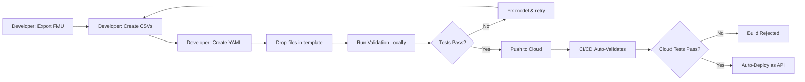

# FMU Platform: System Overview & Developer Onboarding

## 🎯 The End Goal

**Build a scalable, production-ready platform where:**
1. **FMU Developers** can deliver validated models without writing API code
2. **DevOps Teams** can deploy models to the cloud with confidence (automated testing)
3. **End Users** can interact with simulations via REST APIs or dashboards
4. **Quality is Guaranteed**: Cloud simulations match the developer's original results

---

## 🏗️ What This Template Is

This is a **Standardized Deployment Kit** for Modelica FMUs. Think of it like a "Docker for simulations" - it packages your FMU with everything needed to:
- ✅ **Validate** it automatically (CI/CD regression testing)
- ✅ **Document** it automatically (API metadata generation)
- ✅ **Deploy** it as a REST API (real-time simulation server)

---

## 📦 The 3 Components

### 1. **Validation Engine** (`run_tests.py`)
- Runs your FMU with your test data
- Compares results against your reference data
- **Pass/Fail decision** before deployment
- Generates `manifest.json` for API documentation

**Purpose:** Prevent "works on my machine" issues.

### 2. **REST API Server** (`server.py`)
- Exposes FMUs as HTTP endpoints
- Supports both **parameter-based** and **real-time input-based** simulations
- Auto-loads YAML configs for optimized performance

**Purpose:** Enable web apps, dashboards, and digital twins.

### 3. **Docker Container** (`Dockerfile`)
- Bundles everything into a portable image
- **Dual-mode**: Validation (CI/CD) or Server (Production)
- Linux platform ensures cross-platform compatibility

**Purpose:** Deploy anywhere (Google Cloud, AWS, Kubernetes, local).

---

## 👨‍💻 Developer Responsibilities

### Minimum Requirements (Always)
1. **Export FMU**
   - FMI Type: Co-Simulation
   - Binaries: **Must include Linux64**
   - FMI Version: 2.0 or 3.0

2. **Provide Test Data**
   - `tests/stimuli.csv` - Your test inputs
   - `tests/reference.csv` - Your expected outputs

### Recommended for Production
3. **Create YAML Config** (`{ModelName}.yaml`)
   - Defines which parameters/inputs/outputs to expose
   - Provides labels, units, descriptions
   - Makes API clean and self-documenting

---

## 🔄 The Workflow (Developer Journey)



---

## 📁 Required File Structure

```text
inputs/
  ├── v1/
  │   ├── MyModel.fmu           # Your FMU binary
  │   ├── MyModel.yaml          # API config (optional but recommended)
  │   └── tests/
  │       ├── stimuli.csv       # Your test inputs
  │       └── reference.csv     # Your expected outputs
```

**Key Rules:**
- YAML filename **must match** FMU filename (e.g., `MyModel.fmu` → `MyModel.yaml`)
- CSV files **must be in a `tests/` subfolder** next to the FMU
- Multiple versions can coexist (use folders: `v1/`, `v2/`, etc.)

---

## 🧬 Two FMU Types: Parameters vs Inputs

### Type 1: Parameter-Based FMU (Scenario Testing)

**Use Case:** Design validation, what-if analysis

**Modelica Code:**
```modelica
model HeatExchanger
  parameter Real T_hot_inlet = 333.15;  // Fixed design constant
  parameter Real T_cold_inlet = 293.15;
  // ... physics equations ...
end HeatExchanger;
```

**YAML Config:**
```yaml
parameters:
  - name: "T_hot_inlet"
    label: "Hot Inlet Temp"
    default: 333.15

inputs: []  # No runtime inputs

outputs:
  - name: "T_hot_outlet"
```

**API Usage:**
```bash
# Set parameters ONCE
POST /initialize {"parameters": {"T_hot_inlet": 353.15}}

# Step without inputs
POST /step {"dt": 0.1}
```

**When to Use:** Testing different design scenarios, offline simulations

---

### Type 2: Input-Based FMU (Digital Twin)

**Use Case:** Real-time simulation, hardware-in-the-loop, live dashboards

**Modelica Code:**
```modelica
model Pump
  parameter Real diameter = 0.2;  // Design parameter (set once)
  Modelica.Blocks.Interfaces.RealInput speed_cmd;  // Live control signal
  Modelica.Blocks.Interfaces.RealOutput flow_rate;
end Pump;
```

**YAML Config:**
```yaml
parameters:
  - name: "diameter"
    default: 0.2

inputs:
  - name: "speed_cmd"
    label: "Motor Speed"

outputs:
  - name: "flow_rate"
```

**API Usage:**
```bash
# Set design parameters ONCE
POST /initialize {"parameters": {"diameter": 0.25}}

# Send fresh sensor data EVERY STEP
POST /step {"inputs": {"speed_cmd": 1450}, "dt": 1.0}
```

**When to Use:** Connecting to real sensors, predictive control, digital twins

---

## 🎓 Classification Guide for Developers

| Question | If Answer is... | Then it's a... |
|----------|----------------|----------------|
| "Can this value change during runtime?" | ❌ No | **Parameter** |
| "Is this a physical design constant?" | ✅ Yes | **Parameter** |
| "Does this come from a live sensor?" | ✅ Yes | **Runtime Input** |
| "Is this a control signal?" | ✅ Yes | **Runtime Input** |
| "Is this a measurement/prediction?" | - | **Output** |

**Examples:**
- Pipe diameter → **Parameter**
- Heater capacity → **Parameter**
- Design inlet temperature → **Parameter**
- Live sensor temperature → **Runtime Input**
- Valve position command → **Runtime Input**
- Predicted outlet temperature → **Output**

---

## ✅ Quality Gates

### Local Validation (Before Push)
```bash
docker build -t fmu-validator -f docker/Dockerfile .
docker run fmu-validator python /app/scripts/run_tests.py
```

**Checks:**
- FMU loads successfully on Linux
- Simulation runs with `stimuli.csv`
- Results match `reference.csv` (tolerance: 1e-3)
- Metadata extraction succeeds

### Cloud Validation (Automatic)
Same tests run automatically on push. **Build fails** if:
- Missing Linux binaries
- CSVs are malformed
- Results deviate > tolerance
- FMU crashes

---

## 🚀 End Goals Achieved

### For FMU Developers
- ✅ No need to learn FastAPI, Docker, or REST
- ✅ Deliver FMU + CSVs + YAML = Done
- ✅ Confidence that cloud matches local results

### For DevOps
- ✅ Automated testing (no manual verification)
- ✅ Standard deployment process for all FMUs
- ✅ Auto-generated API documentation

### For End Users
- ✅ Clean REST API with only relevant variables
- ✅ Self-documenting (labels, units, descriptions)
- ✅ Scalable (runs in cloud, handles multiple requests)

---

## 🎬 Quick Start Commands

**Local Testing:**
```bash
# 1. Place your files
cp MyModel.fmu inputs/v1/
cp -r tests/ inputs/v1/
cp MyModel.yaml inputs/v1/

# 2. Validate
docker build -t fmu-validator -f docker/Dockerfile .
docker run fmu-validator python /app/scripts/run_tests.py

# 3. Test API locally
docker run -p 8000:8000 fmu-validator
curl http://localhost:8000/fmus
```

**Cloud Deployment:**
```bash
gcloud builds submit --config cloudbuild.yaml
```

---

## 📚 Documentation Reference

| Document | Purpose |
|----------|---------|
| **[FMU_STANDARD.md](FMU_STANDARD.md)** | Official specification (package structure, YAML schema) |
| **[DEVELOPER_GUIDE.md](DEVELOPER_GUIDE.md)** | Step-by-step instructions for FMU developers |
| **[README.md](README.md)** | API documentation and deployment guides |
| **This Document** | High-level overview and developer onboarding |

---

## 🤝 Support & Questions

**Common Questions:**

**Q: Do I need to know Python?**  
A: No. Just export FMU, create CSVs, drop files in template.

**Q: What if I don't have runtime inputs?**  
A: That's fine! Use parameters. YAML `inputs:` section can be empty.

**Q: Can I test multiple scenarios?**  
A: Yes! Create one FMU per scenario, or use versioned folders (`v1/`, `v2/`).

**Q: How do I troubleshoot failed validation?**  
A: Check the Docker logs. Common issues:
- Missing Linux binaries (re-export from Modelica tool)
- CSV column names don't match FMU variables
- Solver tolerances differ (adjust in FMU settings)

---

## 🎯 Success Criteria

You know the system is working when:
- ✅ Your FMU passes local validation
- ✅ Cloud build succeeds automatically
- ✅ API returns only the variables you configured
- ✅ Simulation results match your local tool (within tolerance)
- ✅ Other teams can consume your API without asking you questions

**You've successfully standardized FMU deployment! 🎉**
